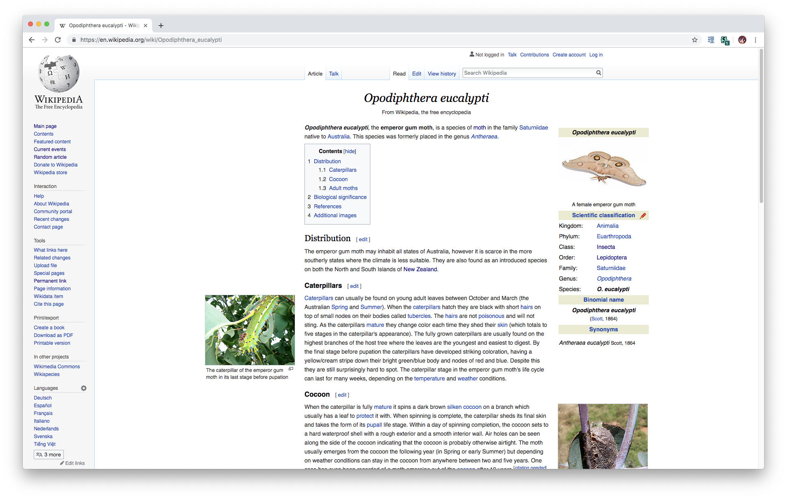

# wikipedia-css
An experimental stylesheet for Wikipedia.

It wraps the text to 600px and floats figures into the margins.

# How to use
If you have a Wikipedia account, see [Help:User style](https://en.wikipedia.org/wiki/Help:User_style).

You can also use a browser extension like [Stylus for Chrome](https://chrome.google.com/webstore/detail/stylus/clngdbkpkpeebahjckkjfobafhncgmne?hl=en).
Open [The raw css file](https://raw.githubusercontent.com/lynn/wikipedia-css/master/wikipedia.user.css) and click "Install style". This also keep it up to date for you.

# Screenshots

Compare to [_Opodiphthera eucalypti_](https://en.wikipedia.org/w/index.php?title=Opodiphthera_eucalypti&oldid=858056162) in your browser:

